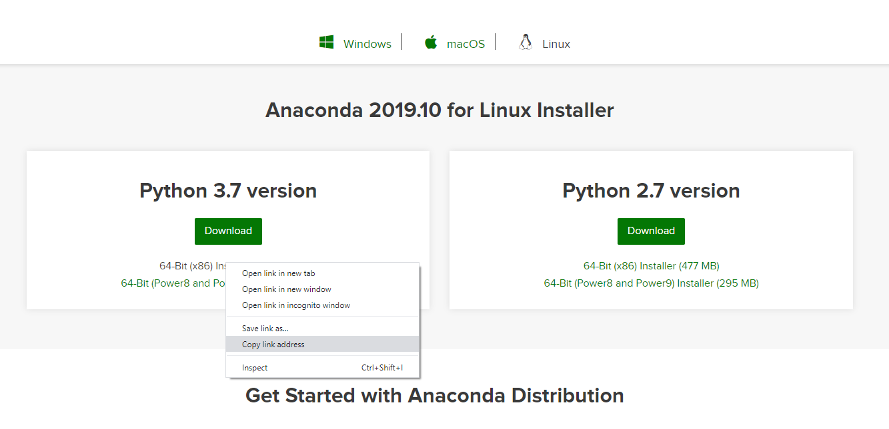
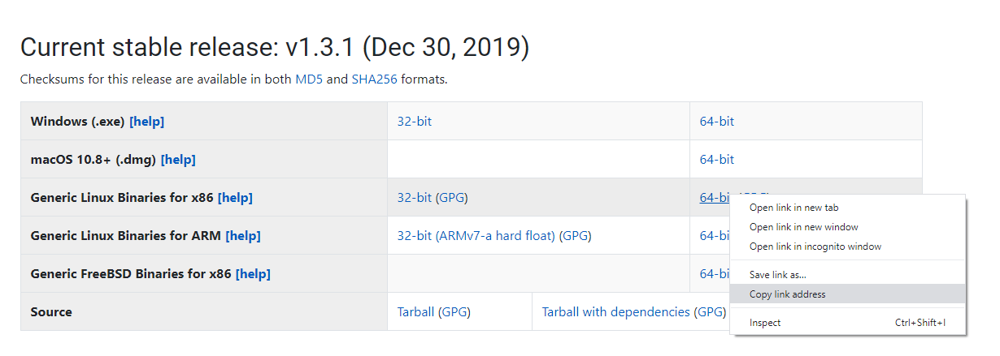

# ESMValTool
[ESMValTool](https://github.com/ESMValGroup/ESMValTool) is a software package that provides diagnostic and performance metrics tools for evaluating Earth system models in CMIP. However, the current version of ESMValTool only supports Unix(-like) operating systems. If you, like me, aren't provided easy access to an Unix-based system, but have Windows 10, there is still hope. 

## Install the Windows 10 Linux Subsystem
See these articles for how to install and activate the Windows 10 Linux Subsystem:
* [Windows Subsystem for Linux Installation Guide for Windows 10](https://docs.microsoft.com/en-us/windows/wsl/install-win10)
* [How to install Windows 10’s Linux Subsystem on your PC](https://www.onmsft.com/how-to/how-to-install-windows-10s-linux-subsystem-on-your-pc)

## Install Anaconda 
Once you have your Windows 10 Linux subsystem up and running, you'll need to install [Anaconda](https://www.anaconda.com/distribution/) on to it

1. Navigate to the [Anaconda download page](https://www.anaconda.com/distribution/) page and select `Linux`. Right-click the appropriate download link for your system's hardware, and select `Copy link address` from the dropdown menu (see image below; I'm running 64-bit Windows so I selected `64-Bit x86 Installer`).


2. Open a Linux command prompt and enter the following:
   ```
   wget <copied-conda-url>
   ```

   This will download the conda installation `.sh` script into your current working directory on your Linux subsystem. 

3. Run the Conda installation script:
   ```
   ./Anaconda3-2019.10-Linux-x86_64.sh
   ```
   An in-depth guide for installing Conda on Linux can be found [here](https://www.digitalocean.com/community/tutorials/how-to-install-anaconda-on-ubuntu-18-04-quickstart).
   
## Install Julia
ESMValTool uses [Julia](https://julialang.org/downloads/), so we have to install that as well.

1. Similarly to downloading the Conda installation script, copy the link address of the appropriate Julia installation package. For Ubuntu Linux, the `Generic Linux Binaries for x86` installation package will work just fine (assuming you're running the 64-bit version of Windows).


   Download the Julia installation package from the Linux command prompt using `wget`:
   ```
   wget <copied-julia-url>
   ```
   Unlike Conda, Julia downloads a `tar.gz` file instead of a script. 
   
2. Place the zipped installation package in the directory where you wish to install Julia. I chose `c/Program Files/julia`. Unzip the package with the following command:
   ```
   tar -xvzf julia_installation_package.tar.gz
   ```
   
3. Follow the [Linux installation instructions](https://julialang.org/downloads/platform/) to add Julia to your Linux path


## Installing ESMValTool - Conda
Once you have Conda and Julia installed on your Linux subsystem, you can install ESMValTool via the [Conda installation method](https://esmvaltool.readthedocs.io/en/latest/getting_started/install.html#conda-installation).

From your Linux command prompt, run the following command to install ESMValTool:
```
conda install -c esmvalgroup -c conda-forge esmvaltool
```

## Installing ESMValTool - From Source
Are you a glutton for pain? Do you hate yourself? Well then [installing ESMValTool from source](https://esmvaltool.readthedocs.io/en/latest/getting_started/install.html#install-from-source) is for you! I don't recommend this method of installation unless you *really* know what you're doing, have a lot of time on your hands, and have some deep-seated self-loathing tendencies. Shoot the moon, bud.
